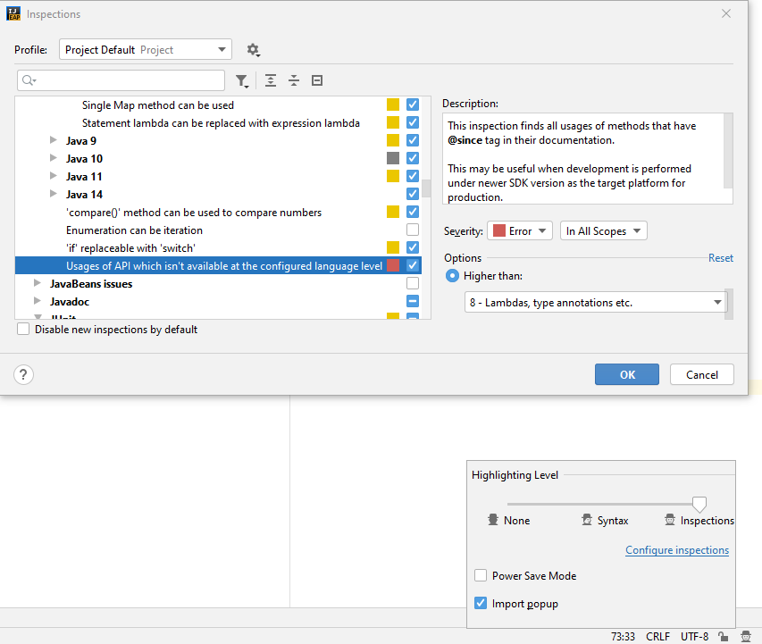

# Jabel - use modern Java 9-14 syntax when targeting Java 8

> Because life is too short to wait for your users to upgrade their Java!


## Motivation

While Java is evolving and introduces new language features, the majority of OSS libraries
are  still using Java 8 as their target because it still dominates.

But, since most of features after Java 8 did not require a change in the bytecode,
`javac` could emit Java 8 bytecode even when compiling Java 12 sources.

## How Jabel works

Although Jabel is a javac compiler plugin, it does not run any processing,
but instruments the java compiler classes and makes it treat some new Java 9+ languages features
as they were supported in Java 8.

The result is a valid Java 8 bytecode for your switch expressions, `var` declarations,
and other features unavailable in Java 8.

## Why it works

The JVM has evolved a lot for the past years. However, most language features
that were added are simply a syntatic sugar. 
They do not require new bytecode, hence can be compiled to the Java 8.

But, since the Java language was always bound to the JVM development, new language features
require the same target as the JVM because they get released altogether.  

As was previously described, Jabel makes the compiler think that certain features were developed
for Java 8, and removes the checks that otherwise will report them as invalid for the target.

It is important to understand that it will use the same desugaring code as for Java 9+ but won't change
the result's classfile version, because the compilation phase will be done with Java 8 target.

## How to use

### Maven
Jabel has to be enabled as a Javac plugin in your maven-compiler-plugin:
```xml
    <profiles>
        <profile>
            <id>intellij-idea-only</id>
            <activation>
                <property>
                    <name>idea.maven.embedder.version</name>
                </property>
            </activation>
            <build>
                <plugins>
                    <plugin>
                        <groupId>org.apache.maven.plugins</groupId>
                        <artifactId>maven-compiler-plugin</artifactId>
                        <configuration>
                            <release>14</release>
                            <compilerArgs>
                                <arg>--enable-preview</arg>
                            </compilerArgs>
                        </configuration>
                    </plugin>
                </plugins>
            </build>
        </profile>
    </profiles>

    <build>
        <plugins>
            <plugin>
                <groupId>org.apache.maven.plugins</groupId>
                <artifactId>maven-compiler-plugin</artifactId>
                <version>3.8.1</version>
                <configuration>
                    <!-- Make sure we're not using Java 9+ APIs -->
                    <release>8</release>
                    <source>14</source>
                    <target>14</target>
                    <!-- The following setting can be avoided on Java 14 and higher -->
                    <compilerArgs>
                        <arg>-Xplugin:jabel</arg>
                    </compilerArgs>
                </configuration>
            </plugin>
        </plugins>
    </build>

    <dependencies>
        <dependency>
            <groupId>com.github.bsideup.jabel</groupId>
            <artifactId>jabel-javac-plugin</artifactId>
            <version>0.4.1</version>
            <scope>provided</scope>
        </dependency>
    </dependencies>
```

Compile your project and verify that Jabel is installed and successfully reports:
```
[INFO] --- maven-compiler-plugin:3.8.1:compile (default-compile) @ tester.thirteen ---
[INFO] Changes detected - recompiling the module!
Jabel: initialized.
```

### Gradle 6 or older
Use the following snippet to add Jabel to your Gradle build:
```gradle
dependencies {
    annotationProcessor 'com.github.bsideup.jabel:jabel-javac-plugin:0.4.2'
}

// Add more tasks if needed, such as compileTestJava
configure([tasks.compileJava]) {
    sourceCompatibility = 14 // for the IDE support

    options.compilerArgs = [
            "--release", "8",
            '--enable-preview',
    ]

    doFirst {
        // Can be omitted on Java 14 and higher
        options.compilerArgs << '-Xplugin:jabel'

        options.compilerArgs = options.compilerArgs.findAll {
            it != '--enable-preview'
        }
    }
}
```

Compile your project and verify that the result is still a valid Java 8 bytecode (52.0):
```shell script
$ ./gradlew --no-daemon clean :example:test

> Task :example:compileJava
Jabel: initialized.


BUILD SUCCESSFUL in 6s
8 actionable tasks: 8 executed

$ javap -v example/build/classes/java/main/com/example/JabelExample.class
Classfile /Users/bsideup/Work/bsideup/jabel/example/build/classes/java/main/com/example/JabelExample.class
  Last modified 31 Aug 2019; size 1463 bytes
  MD5 checksum d98fb6c3bc1b4046fe745983340b7295
  Compiled from "JabelExample.java"
public class com.example.JabelExample
  minor version: 0
  major version: 52
```

### Gradle 7 and newer
Gradle 7 supports toolchains and makes it extremely easy to configure everything:
```gradle
dependencies {
    annotationProcessor 'com.github.bsideup.jabel:jabel-javac-plugin:0.4.2'
    compileOnly 'com.github.bsideup.jabel:jabel-javac-plugin:0.4.2'
}

configure([tasks.compileJava]) {
    sourceCompatibility = 16 // for the IDE support
    options.release = 8

    javaCompiler = javaToolchains.compilerFor {
        languageVersion = JavaLanguageVersion.of(16)
    }
}
```
(Java 16 does not require the preview flag for any language feature supported by Jabel)

You can also force your tests to run with Java 8:
```gradle
compileTestJava {
    sourceCompatibility = targetCompatibility = 8
}

test {
    javaLauncher = javaToolchains.launcherFor {
        languageVersion = JavaLanguageVersion.of(8)
    }
}
```

## IDE support

### IntelliJ IDEA
#### How to avoid using Java 9+ APIs in IntelliJ IDEA
If you set `--release=8` flag, the compiler will report usages of APIs that were not in Java 8 (e.g. `StackWalker`). But if you wish to see such usages while editing the code, you can make IDEA highlight them for you:

* On the bottom right click on the head with the hat
* Click on "Configure inspections"
* Find "Usages of API which isn't available at the configured language level"
* Click "Higher than", and select "8 - Lambdas, type annotations etc." from dropdown


